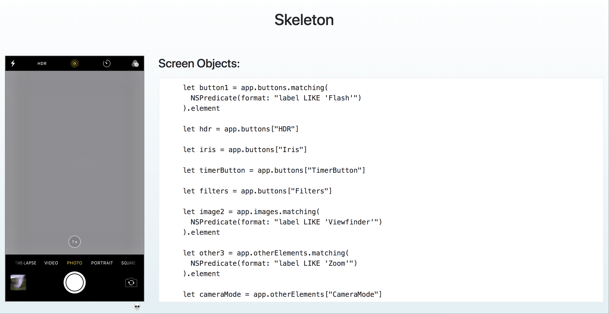

# skeleton
The easiest way to generate multi language page objects from iOS (device/simulator) and Android (device/emulator) screens.

Prerequisites:
--------

#### Global
    $ brew install imagemagick

#### Android
    # Install SDK Tools (http://developer.android.com/sdk/installing/index.html?pkg=tools).
    # SDK tools are added to your $PATH (https://stackoverflow.com/posts/19764254/revisions).
    # Enable USB Debugging (https://www.kingoapp.com/root-tutorials/how-to-enable-usb-debugging-mode-on-android.htm) on your device(s).

#### iOS
    # Install Xcode (https://developer.apple.com/xcode/download/)
    # Install Xcode Command Line Tools (http://railsapps.github.io/xcode-command-line-tools.html)
    $ brew install ideviceinstaller
    $ brew install chargepoint/xcparse/xcparse

Installation:
------
    $ gem install skeleton-ui

Usage:
------
    1. Start skeleton server:
        $ skeleton server
    2. Open device screen
    3. Scan device screen via skeleton:
        $ skeleton scan -p android
            or
        $ skeleton scan -p ios -b "your_app_bundle_id"
    4. Open webpage with generated screen objects on your favorite language

    For more info use:
        $ skeleton -h
        $ skeleton scan -h

Demo:
------

Docs:
------

- [Setting up Skeleton for working with iOS real devices](https://github.com/alter-al/skeleton/blob/master/docs/real-ios-device-config.md)
- [Setting up RVM for deciding permissions problems](https://github.com/alter-al/skeleton/blob/master/docs/permissions_error.md)

## License

A tool is available as open source under the terms of the [MIT License](http://opensource.org/licenses/MIT).
