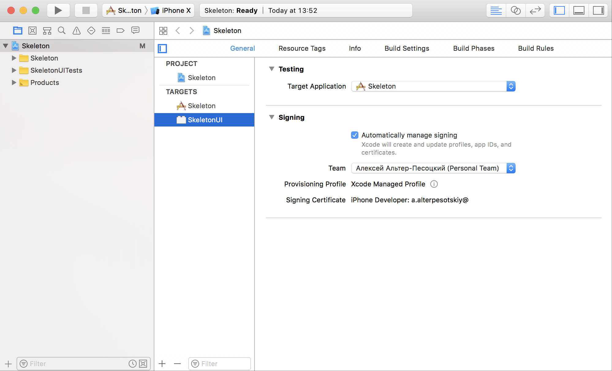
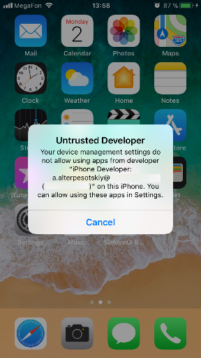

## Setting up Skeleton for working with iOS Real Devices

### First manipulation (sign .xcodeproj)
Open Skeleton.xcodeproj in Xcode. For both the Skeleton and SkeletonUI targets, select "Automatically manage signing" in the "General" tab, and then select your Development Team. This should also auto select Signing Ceritificate. The outcome should look as shown below:

### Second manipulation (trust the developer)

If you see this pop-up, you can go to Settings => General => Device Management on the device to trust
the developer and allow the `SkeletonUI-Runner` app to be run (see [Apple
documentation for more information](https://support.apple.com/en-us/HT204460)).
